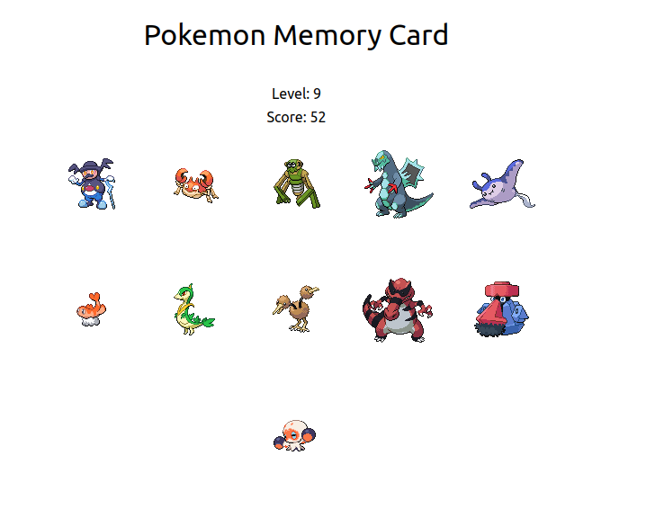

# MemoryCard

How to play: 

Click on one of the pokemons shown and do not click the same pokemons again. When new level starts, the memory resets which means you don't need to worry about pokemons from previous levels. 

API used: PokeAPI: https://pokeapi.co/

Up to 1000 pokemon sprites will be randomly generated!

Idk how to make restart button so just refresh the page if u lose XDDDDDDD
